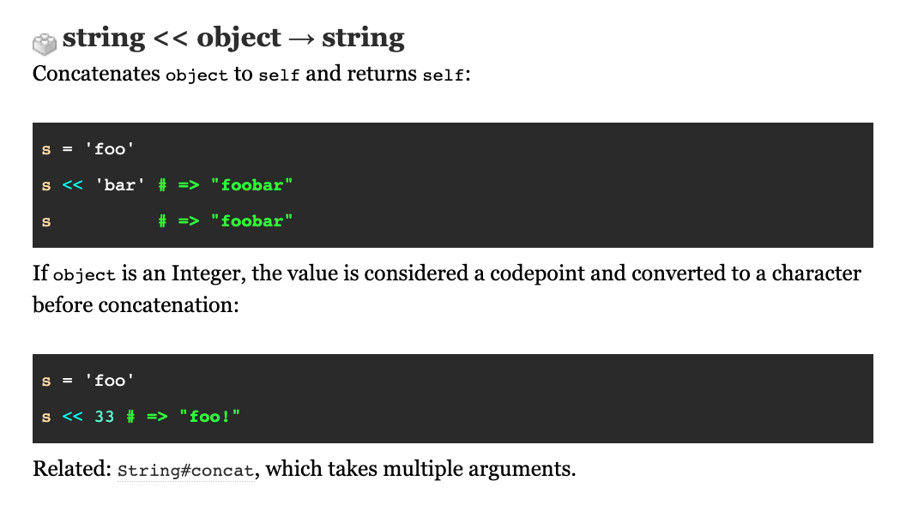

<style type="text/css">
.reveal pre {
  font-size: 1em;
  width: 100%;
}

pre.smaller {
  font-size: 0.75em !important;
}

.smallestest {
  font-size: 0.5em !important;
}

pre.smallest {
  font-size: 0.58em !important;
}

.reveal section img {
  border: none;
}

.monospace {
  font-family: monospace !important;
}
</style>

### Mis-code-ception


Radosław Bułat, github.com/radarek
KRUG, 17.10.2022

---

## The goal is to

{:.fragment}
# have fun

{:.fragment}
### with unusual code.

---

## Agenda

{:.fragmented-list}
* Does Ruby understand SQL?
* How to check if a number is prime using regex?
* Writing code using only symbol characters.
* Deceptive code.

***

### Does Ruby understand SQL?

---

```sql
SELECT `tags`.* FROM `tags`
```

---

{:.smaller}
```bash
[1] pry(main)> SELECT `tags`.* FROM `tags`
Errno::ENOENT: No such file or directory - tags
from (pry):1:in ``'
```

{:.fragment}
### Do you see something interesting?

---

```sql
SELECT `tags`.* FROM `tags`
```
### This SQL is syntatically valid Ruby code!

---

```ruby
SELECT(`tags`.*(FROM(`tags`)))
```

{:.fragment}
```ruby
`tags` # call system command "tags"
```

{:.fragment}
```ruby
SELECT, FROM # method call
```

{:.fragment}
```ruby
`x.*(y)` # x * y
```

---

### Constant vs method

```ruby
Array(1)   # method
Array()    # method
Array 1    # method
Array      # constant
Array.new  # constant.method
```

---

### What about other SQL commands?

---

{:.smallest}
```SQL
DROP TABLE IF EXISTS `tags`;
CREATE TABLE `tags`
  (id int);
ALTER TABLE `tags`
  ADD COLUMN name varchar(255);
INSERT INTO `tags`
  VALUES(1, "krug");
INSERT INTO `tags`
  VALUES(2, "ruby");
INSERT INTO `tags`
  VALUES(3, "programming");
SELECT `tags`.* FROM `tags`;
SELECT `tags`.* FROM `tags`
  WHERE name LIKE "%u%";
```

---

{:.smaller}
```bash
$ mysql -h host.docker.internal magic < demo.sql
id      name
1       krug
2       ruby
3       programming
id      name
1       krug
2       ruby
```

---

{:.smaller}
```bash
$ ruby -r./sql demo.sql
id      name
1       krug
2       ruby
3       programming
id      name
1       krug
2       ruby
```

---

{:.smallester}
### Implementation idea

```ruby
def DROP(...); end
def SELECT(...); end
# etc.
```

---

### Conclusions

* Methods can have capital letters.
* Ruby distinguishes them from constants on syntax level.
* A method and a constant with the same names can coexist.

***

***

### How to check if a number is prime using regex?

---

## What is a prime number?

{:.fragment}
It is an integer number > 1 that is divisible only by itself and 1.

{:.fragment}
6 is not prime because it is divisible by 1, 2, 3 and 6.

{:.fragment}
7 is prime because it is divisible only by 1 and 7.

---

## Regex? Like this?

```ruby
def prime?(n)
  n.to_s.match? /^(2|3|5|7)$/
end
```

---

```ruby
(0..100).select { prime?(_1) }
#=> [2, 3, 5, 7]
```

---

## What about 11, 13 and others?

---

### There is something more clever.

---

# Ready?

---

```ruby
def prime?(n)
  '1'*n !~ /^1?$|^(11+?)\1+$/
end
```

---

```ruby
(0..100).select { prime?(_1) }
#=> [2, 3, 5, 7, 11, (...), 89, 97]
```

---

## How does it work?

---

```ruby
'1'*n !~ /^1?$|^(11+?)\1+$/
```

{:.fragment}


{:.fragment}


---

## What about performance?

---

```ruby
'1111111' =~ /^(11+?)\1+$/
```

---


---

### Conclusions

* Regexes are usefull but can be tricky
* Always test your regexes with different inputs
* Think about worst cases
* Don't use it for primary number checking ;)
* Read the book "Mastering Regular Expressions"

***

***

## Writing code using only symbol characters.

---

Is it possible to write **any** Ruby code using only these characters?

<h3 class="monospace">!"#$%&'()*+,-./:;<=>?@[\]^_`{|}~</h3>

---

### Let's start with something simple.

---

### How to construct any string without using letters?

---

<p class="monospace">
"Hello"
</p>
<p class="monospace">
=>
</p>
<p class="monospace">
"?????"
</p>

---

<h3 class="monospace">String#<<</h3>

---



###### https://ruby-doc.org/core-3.1.2/String.html#method-i-3C-3C

---

```ruby
''<<72<<101<<108<<108<<111
#=> "Hello"
```

---


### How to create any integer using only symbol characters?

---

<p class="monospace">
1
</p>
<p class="monospace">
=>
</p>
<p class="monospace">
?
</p>

---

```ruby
$$/$$
```

{:.fragment}
```ruby
'$'=~/$/
```

{:.fragment}
```ruby
-~($$[-$$])
'>'<=>'<'
$$[-$$]**$$[-$$]
```

---

```ruby
_=$$/$$ #=> 1
__=_+_  #=> 2
```

---

H - 72
```ruby
_+_...+_ # repeat 72 times
# or
(__*(__*(__*(__*(__*(__*_))+_))))
```

---

<p class="smallest monospace" style="text-align: left;">
_=$$/$$;__=_+_;''<<(__*(__*(__*(__*(__*(__*(__*(_-_)+_)))+_))))<<(__*(__*(__*(__*(__*(__*(__*(_-_)+_)+_)))+_))+_)<<(__*(__*(__*(__*(__*(__*(__*(_-_)+_)+_))+_)+_)))<<(__*(__*(__*(__*(__*(__*(__*(_-_)+_)+_))+_)+_)))<<(__*(__*(__*(__*(__*(__*(__*(_-_)+_)+_))+_)+_)+_)+_)
</p>

---

### How to execute code from a string?

---

### eval(string)

---

{:.smallest}
```ruby
_=$$/$$;__=_+_
p eval(''<<(__*(__*(__*(__*(__*(__*(_-_)+_)+_))+_))))
```

---

### What about symbolizing eval?

---

# Ready?

---

```ruby
->(&_){
  _['','eval','<code>']
}[&:"#{'send'}"]
```

source: https://youtu.be/6K7EmeptEHo?t=574

---

### Let's write a compiler.

---

{:.smallest}
```ruby
def decompose(n)
  n == 0 ? '(_-_)' : '('+'__*'+decompose(n/2)+'+_'*(n%2)+')'
end

def s(str)
  ["''", *str.chars.map { decompose(_1.ord) }].join('<<')
end

def compile(code)
  "_=$$/$$;__=_+_;->(&___){___[''," +
  "#{s('eval')},#{s(code)}]}[&:\"\#{#{s('send')}}\"]"
end

puts compile(ARGF.read)
```

---

```shell
$ ruby compiler.rb helloworld.rb
```

---

<p class="smallestest monospace" style="text-align: left;">
_=$$/$$;__=_+_;->(&___){___['',''<<(__*(__*(__*(__*(__*(__*(__*(_-_)+_)+_)))+_))+_)<<(__*(__*(__*(__*(__*(__*(__*(_-_)+_)+_)+_))+_)+_))<<(__*(__*(__*(__*(__*(__*(__*(_-_)+_)+_)))))+_)<<(__*(__*(__*(__*(__*(__*(__*(_-_)+_)+_))+_)+_))),''<<(__*(__*(__*(__*(__*(__*(__*(_-_)+_)+_)+_)))))<<(__*(__*(__*(__*(__*(__*(__*(_-_)+_)+_)+_))+_))+_)<<(__*(__*(__*(__*(__*(__*(__*(_-_)+_)+_)+_))+_)))<<(__*(__*(__*(__*(__*(__*(__*(_-_)+_)+_)+_)))+_)+_)<<(__*(__*(__*(__*(__*(__*(_-_)+_))))))<<(__*(__*(__*(__*(__*(__*(_-_)+_))))+_))<<(__*(__*(__*(__*(__*(__*(__*(_-_)+_)))+_))))<<(__*(__*(__*(__*(__*(__*(__*(_-_)+_)+_)))+_))+_)<<(__*(__*(__*(__*(__*(__*(__*(_-_)+_)+_))+_)+_)))<<(__*(__*(__*(__*(__*(__*(__*(_-_)+_)+_))+_)+_)))<<(__*(__*(__*(__*(__*(__*(__*(_-_)+_)+_))+_)+_)+_)+_)<<(__*(__*(__*(__*(__*(__*(_-_)+_))))))<<(__*(__*(__*(__*(__*(__*(__*(_-_)+_))+_))+_)+_)+_)<<(__*(__*(__*(__*(__*(__*(__*(_-_)+_)+_))+_)+_)+_)+_)<<(__*(__*(__*(__*(__*(__*(__*(_-_)+_)+_)+_)))+_))<<(__*(__*(__*(__*(__*(__*(__*(_-_)+_)+_))+_)+_)))<<(__*(__*(__*(__*(__*(__*(__*(_-_)+_)+_)))+_)))<<(__*(__*(__*(__*(__*(__*(_-_)+_)))))+_)<<(__*(__*(__*(__*(__*(__*(_-_)+_))))+_))<<(__*(__*(__*(__*(_-_)+_))+_))]}[&:"#{''<<(__*(__*(__*(__*(__*(__*(__*(_-_)+_)+_)+_)))+_)+_)<<(__*(__*(__*(__*(__*(__*(__*(_-_)+_)+_)))+_))+_)<<(__*(__*(__*(__*(__*(__*(__*(_-_)+_)+_))+_)+_)+_))<<(__*(__*(__*(__*(__*(__*(__*(_-_)+_)+_)))+_)))}"]
</p>

---

{:.smaller}
```shell
$ ruby compiler.rb helloworld.rb  | ruby
Hello World!
```

---


---

### What if...

{:.smaller .fragment}
```bash
$ ruby compiler.rb compiler.rb > compiler2.rb
```

{:.fragment}


---

### Conclusions

* Generating code is fun
* Generating useless code is uber fun ;)

***

***

## Deceptive code

---

```bash
$ ls
innocent_code.rb
```

---

```bash
$ ruby innocent_code.rb 
This code is evil
```

## Oh no 😱!

---

```bash
$ cat innocent_code.rb
puts "This code is innocent"
```

{:.fragment}
### How?

---

```ruby
File.write(__FILE__, <<CODE)
puts "This code is innocent"
CODE
puts "This code is evil"
```

---

```bash
$ ls
innocent_code2.rb
```

---

```bash
$ cat innocent_code2.rb
puts "This code is innocent"
```

---

```bash
$ more innocent_code2.rb
puts "This code is innocent"
```

---

```bash
$ ruby innocent_code2.rb
This code is evil
$ cat innocent_code2.rb
puts "This code is innocent"
```

{:.fragment}
### How?

---

{:.smaller}
```ruby
puts "This code is evil"||"^H^H^H^H^H^H^H^Hinnocent"
```

---

### Conclusions
* Don't trust your intuition
* If you think you know how something works then ... you may be wrong

***

# Thank you!